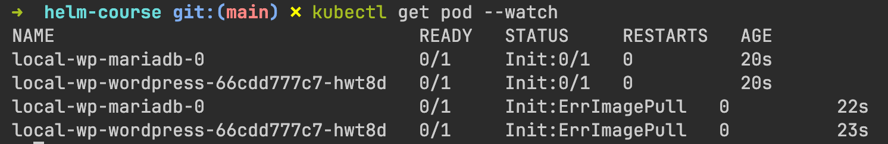

# The Definitive Helm Course: From Beginner to Master

This repository contains all the code implemented during my complete Helm course! Check right below for the link with a great discount

### Course link (with a big discount 🙂): https://www.lauromueller.com/courses/definitive-helm-course

**Check my other courses:**

- 👉 The Complete Docker and Kubernetes Course: From Zero to Hero - https://www.lauromueller.com/courses/docker-kubernetes
- 👉 Mastering Terraform: From Beginner to Expert - https://www.lauromueller.com/courses/mastering-terraform
- 👉 Mastering GitHub Actions: From Beginner to Expert - https://www.lauromueller.com/courses/mastering-github-actions
- 👉 Write better code: 20 code smells and how to get rid of them - https://www.lauromueller.com/courses/writing-clean-code

Welcome everyone! I'm very happy to see you around, and I hope this repository brings lots of value for those learning more about Helm. Make sure to check the link above for a great discount on the course, where I not only provide theoretical explanations around all the concepts here, but also go in details through the entire coding of the examples in this repository.

Here are a few tips for you to best navigate the contents of this repository:

1. The folder `_exercises` contains practical steps for you to try to implement the hands-on labs we go through throughout the course. They are organized based on the sections of the course, so you can easily match the folder and the section by title, as well as the exercise file and the corresponding hands-on lab video in the course.
   
2. Each section in the course has one or more folders associated with it, and each folder contains all the files and code for the respective topic. Sometimes, sections have more than one folder, but it should be very straightforward to identify the correct folder based on the lecture titles, as I tried to keep the naming as consistent as possible.

##  Very Important

IMPORTANT! Changes to Bitnami Charts and Images
⚠️ IMPORTANT! Breaking Changes to Bitnami Charts and Images ⚠️
Hello everyone! Unfortunately, Broadcom (who owns Bitnami) has decided on a strong move regarding its Docker images: most of them will be removed from the Docker registry, and they are now pushing hard to sell their "security-hardened" images.

In practical terms, the following will happen:

Bitnami will delete all older image tags from their Docker repositories. The only ones that will be available are the images with the latest tag.

The older tags and images will be moved to the bitnamilegacy repository, where they will be available for some time (not clear for how long).

Since this course uses a few of their images for demonstration purposes, this will inevitably impact the commands we use in the upcoming lectures. Please bear with me as I redesign the lectures and re-record them to use other charts; the entire process does require some time 😅 Meanwhile, I'm providing instructions here for short-term adjustments you can use for the commands to continue to work.

As this is a major breaking change, I'd also kindly ask for your patience and support as we all figure out the extent of the failing commands and the necessary adjustments. If the instructions in this file are incomplete or you are still facing errors after following them, please reach out in the Q&A with the error you are facing, and we'll find a solution together. I'll also update this reference document as we find out more about all the necessary adjustments. Thank you once again for your amazing support and understanding 🙂

Which Kind of Error Will You Experience?
When installing a Helm chart that leverages an earlier image tag not available in the Bitnami Docker repositories, you should see an error similar to the one below:





This happens because the image tags are fixed in the provided Helm charts, but they are not available in the default Bitnami Docker repository anymore 😕 How can we tackle this?

Uninstalling Broken Helm Charts
If you installed the chart without following the directions in the "Installing Helm Charts" section of this guide, you are likely to run into the ErrImagePull problem. If this happens, make sure to first uninstall the existing Chart installation. We go through the details of uninstalling Helm charts in Lecture 23: Uninstalling Helm Charts and Lecture 24: Cleaning up Kubernetes resources.

The commands you need to run are as follows:

```shell
helm uninstall local-wp (or the name of your release)

kubectl delete pvc data-local-wp-mariadb-0 (when uninstalling the Wordpress chart)

```
If the chart you have installed created other resources that are not removed when running the helm uninstall command, make sure to clean them up manually!

Installing Helm Charts
Below you will find a series of steps you can follow in case you start seeing Image Pull Errors when installing the Helm charts. After uninstalling the problematic Helm Chart by following the instructions from above, there are a couple of options you could adopt:

1. Set the Docker repositories to point to the bitnamilegacy registry.

This is a short-term solution that will enable you to continue working with the exact same chart versions I use in the videos. However, it does require you to explicitly set a couple of values when running Helm commands. We haven't explored this at this specific point of the course, but the process is fairly straightforward:

1. Create a new YAML file, for example wp-repo-overrides.yaml.

2. For the Wordpress chart, add the following contents to the file:


```yaml
image:
  registry: docker.io
  repository: bitnamilegacy/wordpress
 
mariadb:
  image:
    registry: docker.io
    repository: bitnamilegacy/mariadb

```

3. Once the file is created, add the following to the helm template, helm install, and helm upgrade commands we execute: --values <path to file>. For example:

```
helm template bitnami/wordpress becomes helm template bitnami/wordpress --values wp-repo-overrides.yaml

helm install local-wp bitnami/wordpress becomes helm install local-wp bitnami/wordpress --values wp-repo-overrides.yaml

```
This will enable you to continue using the same chart versions from the lectures for the moment, and you should still be able to install the applications on your Kubernetes cluster.

⚠️ IMPORTANT: You will also need to set these values at later points in the course when we discuss chart dependencies and Helm plugins.

2. Pick another Helm chart to follow along.

This is perhaps the more stable option, although also far from optimal for the time being. It simply requires you to pick another Helm chart instead of the Wordpress one we will use in the upcoming lectures. This will lead to some divergence between what I demonstrate on the videos and the exact commands you need to execute, but perhaps this can also work as a good learning opportunity! Here are a few suggestions:

Grafana: https://artifacthub.io/packages/helm/grafana/grafana

Prometheus: https://artifacthub.io/packages/helm/prometheus-community/prometheus

Kubernetes dashboard: https://artifacthub.io/packages/helm/k8s-dashboard/kubernetes-dashboard

In practice, this means that you should follow the installation instructions from the respective chart instead of the ones I execute in the terminal.